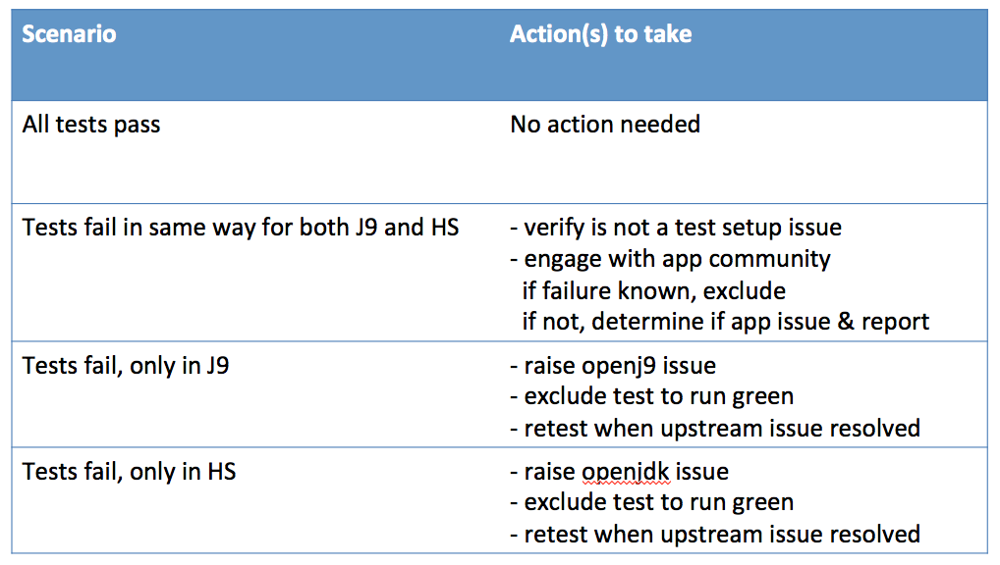

# External (Third Party Container) Tests

Third Party container tests help verify that the adoptium binaries are *good* by running a variety of Java applications inside of containers. adoptium/aqa-tests/[Issue #172](https://github.com/adoptium/aqa-tests/issues/172) lists the applications that we have initially targeted to best exercise the adoptium binaries.  For each application, we choose to run a selection of their functional tests.

## Podman, docker and others. Sudo, runas and others

The toolchain understands two environment variables:
```
EXTERNAL_AQA_RUNNER=docker|podman|...
```
defaults to podman if podman is installed, otherwise to docker

and
```
EXTERNAL_AQA_SUDO=sudo||runas 
```
which defaults to empty string
```
EXTERNAL_AQA_CONTAINER_CLEAN=true|false
```
If EXTERNAL_AQA_CONTAINER_CLEAN is false, then the image is not cleaned after the `make _tests...` targets are finished.

## Configuring base image
By default, Eclipse Temurin JDK of identical version as your JDK is used. You can see, that `print_image_args` is taking all arguments to properly set registry url, image name and version. `EXTERNAL_AQA_IMAGE` variable describes the usual image ID in form  of `optional_registry/path/name:tag` to allow for alternate images besides the default to be used.

## Running External tests locally
To run any AQA tests locally, you follow the same pattern:

0. Ensure your test machine is set up with [test prereqs](https://github.com/adoptium/aqa-tests/blob/master/doc/Prerequisites.md).  For external tests, you do need Docker or Podman installed.

1. Download/unpack the SDK that you want to test to your test machine
1. `export TEST_JDK_HOME=</pathToWhereYouInstalledSDK>`
1. `git clone https://github.com/adoptium/aqa-tests.git`
1. `cd aqa-tests`
1. `./get.sh`
1. `cd TKG`
1. export required environment variables, BUILD_LIST and EXTRA_DOCKER_ARGS (example: `export BUILD_LIST=external/jacoco` and `export EXTRA_DOCKER_ARGS="-v $TEST_JDK_HOME:/opt/java/openjdk"`
1. `make compile`              (This fetches test material and compiles it, based on build.xml files in the test directories)
1. `make _jacoco_test`   (When you defined BUILD_LIST to point to a directory in [aqa-tests/external](https://github.com/adoptium/aqa-tests/tree/master/external), then this is a testCaseName from the playlist.xml file within the directory you chose)


When [running these from the command-line](https://github.com/adoptium/aqa-tests/blob/master/doc/userGuide.md#local-testing-via-make-targets-on-the-commandline), these tests are grouped under a make target called 'external', so 'make external' would run the entire set of tests found in the aqa-tests/external directory.  This is unadvisable!  Limit what you compile and run, BUILD_LIST=external/`<someSubDirectory>`, and TARGET=`<testCaseNameFromSubdirPlaylist>`

These tests run regularly and results can be found in [TRSS Third Party Application view](https://trss.adoptopenjdk.net/ThirdPartyAppView).

See the [roadmap](https://github.com/adoptium/aqa-tests/tree/master/external#roadmap) for additional ways we plan to expand this approach.

### Roadmap
Our next steps to improve and expand this set of external tests is divided into 2 categories:
#### Technical Goals
- Verify the container images that the project produces
- Copy results from container for easier viewing and triage in Jenkins
- Quick compare view, easy comparison of how different implementations stack up
- Parallel testing (to improve execution time)
- Startup-only testing (application startup, but not full runs of app functional testing)
- Add high-value tests that exercise the adoptium binaries, including but not limited to functional test suites and Microprofile compliance tests (plan to start with [Fault Tolerance TCK](https://github.com/eclipse-openj9/microprofile-fault-tolerance/blob/master/tck/running_the_tck.asciidoc) and [Metrics API TCKs](https://github.com/eclipse-openj9/microprofile-metrics/blob/master/tck/running_the_tck.asciidoc) against [GlassFish](https://javaee.github.io/glassfish/) EE reference implementation)

#### Strategic Goals
- Engage with application communities, including the Eclipse Jakarta EE project, to:
    - report and resolve application test failures
    - get more involvement with testing adoptium binaries
    - encourage use of adoptium binaries, add extra OpenJDK versions and variants in their build farms

### Triage Rules
There are 4 common triage scenarios, with associated appropriate actions to take:


### How to Add New Tests
- Learn how to run the application tests that you intend to automate in the build manually first, and find out any special dependencies the application testing may have.
- Clone https://github.com/adoptium/aqa-tests.git and look at external directory.
- Copy the 'example-test' subdirectory and rename it after the application you are adding.
- Modify the files in your new sub-directory according to your needs.
- Check in the changes into https://github.com/[YOUR-BRANCH]/aqa-tests and test it using a <a href="https://github.com/adoptium/aqa-tests/wiki/How-to-Run-a-Personal-Test-Build-on-Jenkins">personal build</a>.

#### Which files do I need to modify after making a copy of example-test?

**Dockerfile**
- The example Dockerfile contains a default list of dependent executable files. Please read the documentation of the third party application you are enabling to find out if you need any executable files other than the default set, if yes, add them to the list.
- Update the clone command based on your third party application's source repository.

 **Shell script**
- Replace the example command line at the bottom of this script with the initial command lines that trigger execution of your test.

**build.xml**
- Update the distribution folder paths, container image name etc according to the name of your application.

**playlist.xml**
- Update the name of the example test case to the actual test case of the third party application that you intend to run.

Please direct questions to the [#testing Slack channel](https://adoptium.slack.com/archives/C5219G28G).
